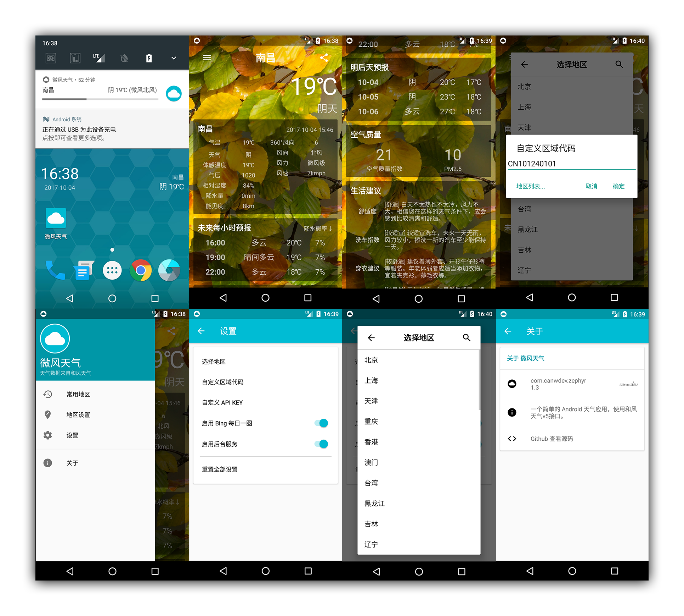

# 微风天气 · Zephyr Weather


一个简单的 Android 天气应用，使用和风天气接口。

A simple Android weather app using the heweather API.

* The first commit code from my another project [learn_android_1stcode](https://github.com/canwdev/learn_android_1stcode)

---

### 功能特性 · Feature

* 可显示天气详细信息、每小时预报、3天预报、空气质量以及生活建议
* 多城市跳转，选择城市历史记录
* 支持城市搜索，自定义 weatherId 与 apiKey
* 可分享天气信息截图
* 以 Bing 每日一图作为背景（可关闭）
* 后台天气通知服务（可选开启）
* 支持天气时钟小部件

---



---

### Open Source License

```
GNU LESSER GENERAL PUBLIC LICENSE Version 2.1, February 1999
```

```
compile 'org.litepal.android:core:1.6.0'
compile 'com.squareup.okhttp3:okhttp:3.4.1'
compile 'com.google.code.gson:gson:2.7'
compile 'com.github.bumptech.glide:glide:3.7.0'
compile 'de.hdodenhof:circleimageview:2.1.0'
```